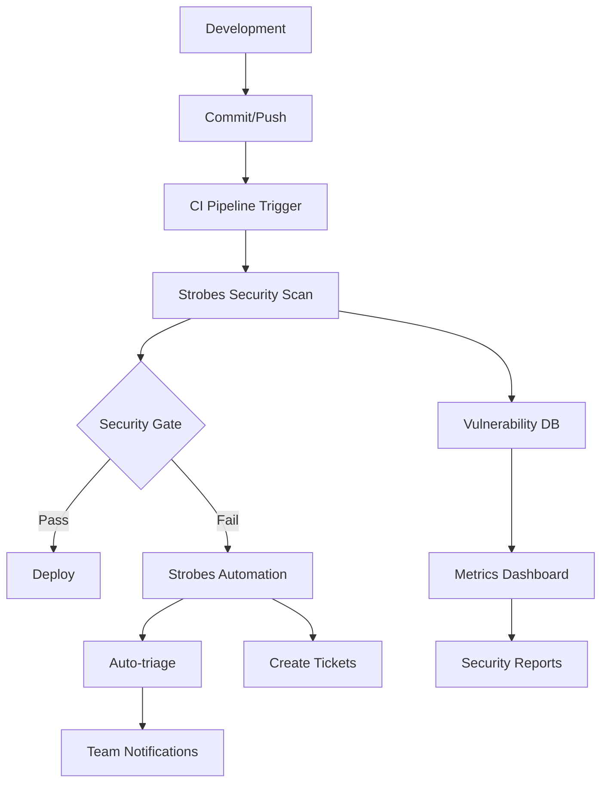
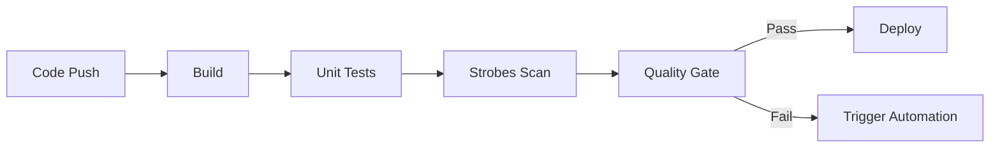
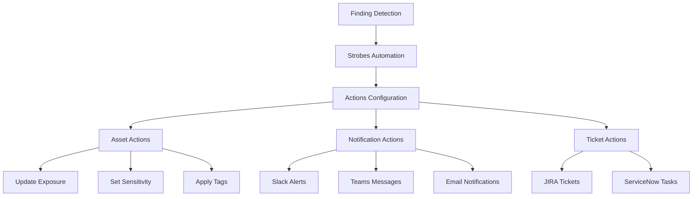

# DevSecOps Integration Guide with Strobes: A Complete Implementation Guide

## References
- https://help.strobes.co/hc/en-us/articles/19743359033362-Configuring-Actions-in-Strobes-Automation
- https://help.strobes.co/hc/en-us/articles/16876612467602-Container-Scanning-Workflow-Configuration-Guide
- https://help.strobes.co/hc/en-us/articles/16870751665426-SCA-SBOM-Workflow-Configuration-Guide

## Introduction

This comprehensive guide demonstrates how to integrate Strobes security capabilities into your CI/CD pipeline, including automated scanning, security gates, and automated response workflows using Strobes Automation. Learn how to build a robust DevSecOps practice that ensures security throughout your development lifecycle.

## Overview of DevSecOps Integration



## 1. Initial Setup and Configuration

### 1.1 Strobes SCA Configuration

Configure the Software Composition Analysis scanner:

1. Navigate to Connectors → Add New → Strobes SCA
2. Configure version control system:
   - Select GitHub/GitLab/Bitbucket/Azure Repos
   - Provide authentication details
   - Configure repository access
3. Set scanning parameters:
   - Enable commit/push scanning
   - Configure scan frequency
   - Set up Smart Auto-closure
   - Configure agents

### 1.2 API Configuration for CI/CD Integration

```python
from strobes_gql_client.client import StrobesGQLClient

class StrobesConfig:
    def __init__(self):
        self.client = StrobesGQLClient(
            host="demovm.strobes.co",
            api_token="your_strobes_api_token_here"
        )
        self.org_id = "your_org_id"
```

## 2. CI/CD Pipeline Integration

### 2.1 Pipeline Configuration



### 2.2 Scan Implementation

```python
class StrobesScanTrigger:
    def __init__(self, config: ScanConfig):
        self.scanner = CICDScanner(config.base_url, config.token)
        
    def trigger_scan(self, repo_name: str):
        scan_config = ScanConfig(
            configuration_id=4,
            target=repo_name
        )
        
        try:
            scan_response = self.scanner.initiate_scan(scan_config)
            return self.monitor_scan(scan_response['task_id'])
        except Exception as e:
            logging.error(f"Scan initiation failed: {e}")
            raise
```

### 2.3 Security Gates

```python
def implement_security_gate(scan_results):
    """
    Implement security gates based on findings
    """
    gates = {
        'critical': 0,
        'high': 5,
        'medium': 10,
        'low': 20
    }
    
    for severity, threshold in gates.items():
        if scan_results[f'{severity}_count'] > threshold:
            return False, f"Too many {severity} findings"
    
    return True, "Security gate passed"
```

## 3. Strobes Automation Setup

### 3.1 Overview



### 3.2 Setting Up Automation Rules

1. **Access Automation**:
   - Navigate to Settings → Automation
   - Click "Add New Automation"
   - Select "Strobes Action"

2. **Configure Steps**:

   a. **Step 1 - Tool Selection**:
   - Choose "Strobes Action" as the automation tool
   
   b. **Step 2 - Hook Selection**:
   - Select triggering events (e.g., Finding Created, Severity Changed)
   - Configure hook parameters
   
   c. **Step 3 - Filter Configuration**:
   - Set conditions for automation trigger
   - Define asset or finding criteria
   
   d. **Step 4 - Action Configuration**:
   - Select actions to perform
   - Configure action parameters

### 3.3 Common Automation Scenarios

1. **Critical Finding Response**:
   - Trigger: New critical finding detected
   - Actions:
     - Update asset exposure to "Critical"
     - Send immediate Slack notification
     - Create high-priority JIRA ticket

2. **Automated Triage**:
   - Trigger: New finding detected
   - Actions:
     - Apply severity-based tags
     - Route to appropriate team
     - Set initial status

3. **SLA Management**:
   - Trigger: SLA breach imminent
   - Actions:
     - Send escalation notifications
     - Update ticket priority
     - Add SLA warning tags

### 3.4 Setting Up Notifications

1. **Slack Integration**:
   - Navigate to Automation settings
   - Add Slack action
   - Configure channel and message preferences
   - Map severity to notification urgency

2. **Teams Integration**:
   - Configure Teams webhook
   - Set up message templates
   - Define notification rules

3. **Email Alerts**:
   - Configure email settings
   - Set up distribution lists
   - Define email templates

## 4. Metrics and Monitoring

### 4.1 Security Metrics Collection

1. Track key metrics:
   - Findings by severity
   - Mean time to remediate
   - SLA compliance
   - False positive rates

2. Monitor scan performance:
   - Scan duration
   - Coverage metrics
   - Integration health

### 4.2 Dashboard Configuration

1. Executive Dashboards:
   - Risk overview
   - Compliance status
   - Trend analysis
   
2. Operational Dashboards:
   - Daily findings
   - Team performance
   - SLA tracking

## 5. Best Practices

### 5.1 Pipeline Optimization
- Run scans in parallel
- Implement caching strategies
- Use incremental scanning
- Configure retry mechanisms

### 5.2 Automation Best Practices
1. Start Simple:
   - Begin with basic automations
   - Test thoroughly
   - Gradually add complexity

2. Define Clear Rules:
   - Clear trigger conditions
   - Specific action parameters
   - Documented exceptions

3. Monitor Performance:
   - Track automation effectiveness
   - Monitor false positives
   - Regularly review rules

### 5.3 Developer Experience
- Provide clear remediation guidance
- Enable self-service capabilities
- Maintain feedback channels
- Regular training updates

## 6. Troubleshooting Guide

### 6.1 Common Issues
1. **Scan Failures**:
   - Check API connectivity
   - Verify credentials
   - Review scan logs
   - Check resource limits

2. **Automation Issues**:
   - Verify trigger conditions
   - Check action configurations
   - Review automation logs
   - Test integrations

### 6.2 Resolution Steps
1. For Scan Issues:
   - Review scan configuration
   - Check network connectivity
   - Verify permissions
   - Monitor resource usage

2. For Automation Issues:
   - Review automation logs
   - Test trigger conditions
   - Verify integration status
   - Check action parameters

## Conclusion

This implementation guide provides a foundation for implementing a robust DevSecOps pipeline using Strobes. Key takeaways:

1. Start with proper CI/CD integration
2. Leverage Strobes Automation for responses
3. Configure appropriate notifications
4. Monitor and optimize
5. Maintain developer satisfaction

