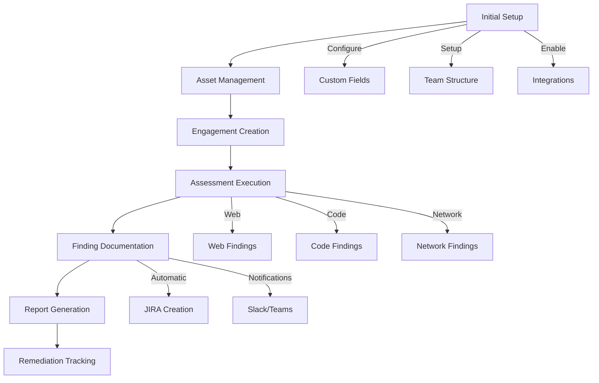
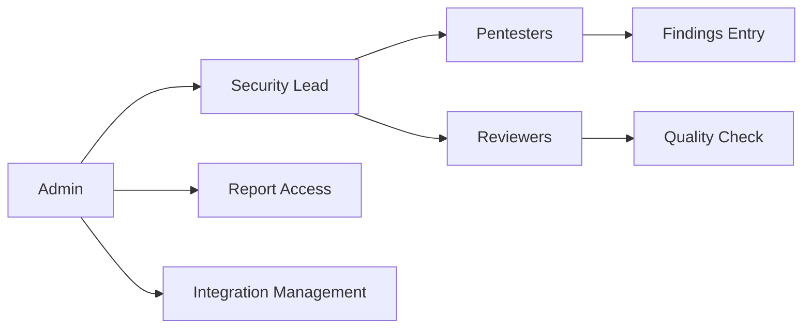
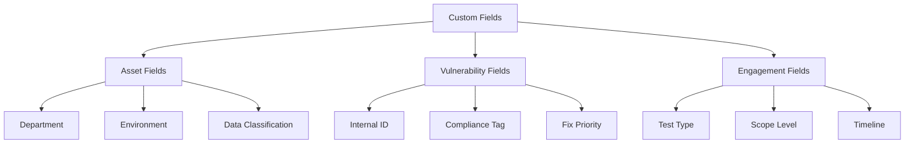
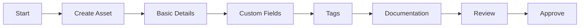
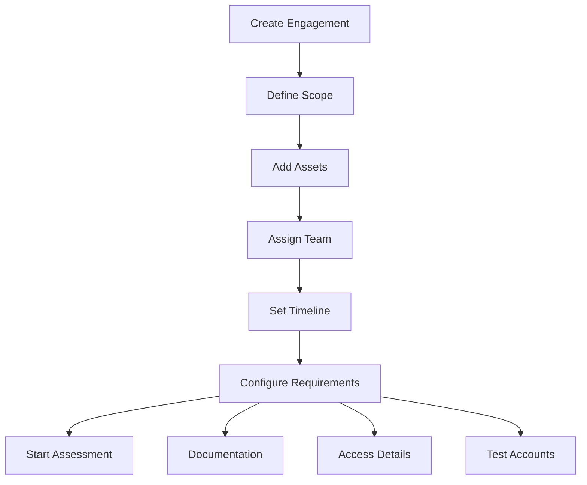
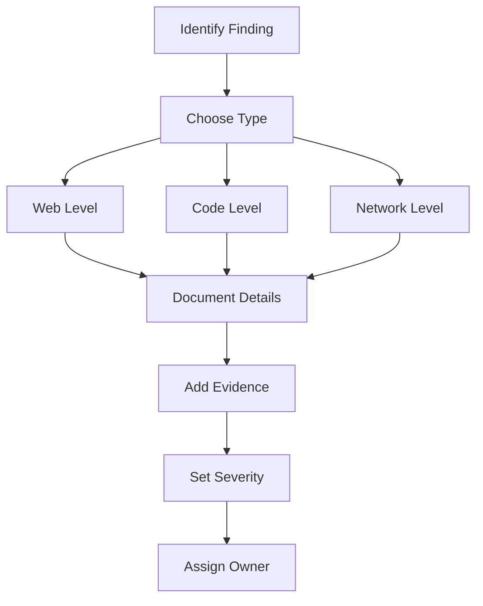
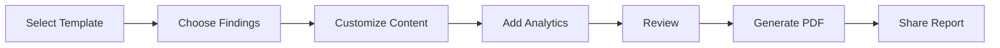
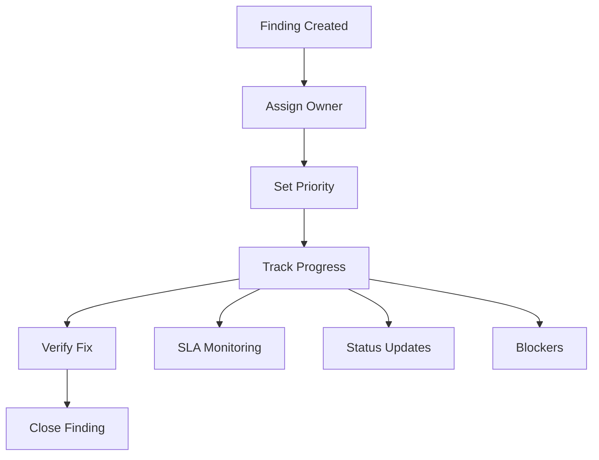

# Managing Internal Pentests with Strobes: A Complete Implementation Guide

## Reference Links
- https://help.strobes.co/hc/en-us/articles/15718185453969-Asset-Custom-Fields
- https://help.strobes.co/hc/en-us/articles/15740160397585-Vulnerability-Custom-Fields
- https://help.strobes.co/hc/en-us/articles/4419242654481-Submitting-a-Web-Level-Vulnerability


## Introduction

Managing internal penetration tests can be complex and challenging, especially when dealing with multiple teams, various assets, and different types of findings. This comprehensive guide demonstrates how to leverage Strobes to streamline and automate your internal pentest management process, from initial setup through reporting and remediation tracking.

## Overview of Implementation Process



## 1. Initial Platform Setup

### 1.1 Team Structure Configuration

Before beginning internal pentests, it's crucial to set up your team structure in Strobes. This ensures proper access control and workflow management.



Follow these steps to configure your team:

1. Navigate to Settings → User Management
2. Create user groups based on roles:
   - Security Team Leads
   - Internal Pentesters
   - Reviewers
   - Developers
   - Compliance Officers
3. Assign appropriate permissions to each group:
   - Finding creation/editing
   - Report generation
   - Asset management
   - Integration configuration

Each role serves a specific purpose in the pentest workflow. Security leads oversee the entire process, pentesters conduct assessments and document findings, while reviewers ensure quality and consistency of documentation.

### 1.2 Custom Fields Configuration

Strobes allows extensive customization through custom fields. For internal pentests, you'll want to set up specific fields to track internal-specific information.



Required custom fields for effective tracking:

1. Asset Custom Fields:
   - Department Owner
   - Internal Classification (Restricted/Internal/Public)
   - Environment (Dev/Stage/Prod)
   - Business Criticality
   - Compliance Requirements

2. Vulnerability Custom Fields:
   - Internal Tracking ID
   - Remediation Owner
   - Compliance Impact
   - Retest Status
   - Fix Verification Notes

3. Engagement Custom Fields:
   - Assessment Type (White/Gray/Black Box)
   - Budget Code
   - Stakeholder Contact
   - Previous Assessment Reference

### 1.3 Integration Setup

To maximize efficiency, configure essential integrations:

1. JIRA Integration:
   - Configure project mapping
   - Set up custom field mapping
   - Define workflow transitions
   - Enable bidirectional updates

2. Slack/Teams Integration:
   - Set up channels for notifications
   - Configure alert rules
   - Define notification templates

3. CI/CD Integration:
   - Connect with Jenkins/GitLab
   - Configure scan triggers
   - Set up feedback loops

## 2. Asset Management

### 2.1 Asset Onboarding Process



For each internal asset:

1. Navigate to Assets → Add New Asset
2. Select appropriate asset type:
   - Web Application
   - Network
   - Cloud Infrastructure
   - Mobile Application
3. Provide detailed information:
   - Asset name and description
   - Internal URL/IP range
   - Technology stack
   - Business context
4. Add custom field information
5. Assign appropriate tags
6. Upload relevant documentation

### 2.2 Asset Organization

Implement a structured approach to asset management:

1. Naming Convention:
   ```
   [Department]-[Environment]-[AssetName]
   Example: HR-PROD-EmployeePortal
   ```

2. Tagging Strategy:
   - Environment tags (dev/stage/prod)
   - Business unit tags
   - Compliance tags (SOX/PCI/HIPAA)
   - Technology tags

## 3. Creating and Managing Engagements

### 3.1 Engagement Setup



Step-by-step engagement creation:

1. Navigate to Engagements → New Engagement
2. Define engagement parameters:
   - Title and description
   - Start and end dates
   - Assessment type
   - Team members
3. Add assets to scope
4. Configure prerequisites:
   - VPN details
   - Test accounts
   - Environment access
   - Testing boundaries

### 3.2 Assessment Execution

During the assessment phase:

1. Track progress through stages:
   - Reconnaissance
   - Scanning
   - Vulnerability Assessment
   - Exploitation
   - Post-Exploitation
   - Documentation

2. Use built-in tools:
   - Vulnerability templates
   - Evidence collection
   - Status tracking
   - Team communication

## 4. Finding Documentation

### 4.1 Vulnerability Management



For each finding type:

#### Web Level Vulnerabilities
1. Document affected endpoints
2. Include HTTP requests/responses
3. Provide reproduction steps
4. Add screenshots/videos
5. Suggest remediation steps

#### Code Level Vulnerabilities
1. Specify file location
2. Include line numbers
3. Add vulnerable code snippets
4. Provide secure code examples
5. Reference secure coding guidelines

#### Network Level Vulnerabilities
1. Document affected services
2. Include port information
3. Add exploitation proof
4. Specify affected configurations
5. Provide hardening recommendations

### 4.2 Evidence Collection

Maintain thorough documentation:

1. Screenshots/Videos
   - Clear issue demonstration
   - Redacted sensitive data
   - Step-by-step reproduction

2. Raw Data
   - Network captures
   - HTTP requests/responses
   - Configuration files

## 5. Reporting and Analytics

### 5.1 Report Generation



Create comprehensive reports:

1. Choose report type:
   - Executive Summary
   - Technical Report
   - Compliance Report
   - Status Update

2. Include key sections:
   - Methodology
   - Findings summary
   - Risk analysis
   - Remediation roadmap

### 5.2 Metrics Tracking

Monitor key performance indicators:

1. Assessment Metrics:
   - Coverage percentage
   - Finding severity distribution
   - Time to document
   - Quality scores

2. Remediation Metrics:
   - Time to fix
   - Verification status
   - SLA compliance
   - Regression rate

## 6. Remediation Management

### 6.1 Tracking Process



Implement structured remediation tracking:

1. Assignment and Prioritization:
   - Assign to appropriate teams
   - Set remediation deadlines
   - Define verification requirements

2. Progress Monitoring:
   - Track status changes
   - Monitor SLA compliance
   - Document blockers
   - Update stakeholders

### 6.2 Automation Rules

Configure automation for efficiency:

1. Ticket Creation:
   - Automatic JIRA tickets
   - Priority mapping
   - Field synchronization

2. Notifications:
   - SLA warnings
   - Status updates
   - Assignment notifications
   - Verification requests

## Conclusion

Following this implementation guide will help establish a robust internal pentest management process using Strobes. Key success factors include:

1. Proper initial setup and configuration
2. Consistent documentation practices
3. Effective use of automation features
4. Regular process reviews and improvements

Remember to regularly:
- Review and update custom fields
- Refine templates and workflows
- Train new team members
- Gather feedback for improvements
- Monitor metrics for optimization

By leveraging Strobes' features effectively, organizations can significantly improve their internal pentest management efficiency, maintain better documentation, and ensure consistent remediation tracking.
