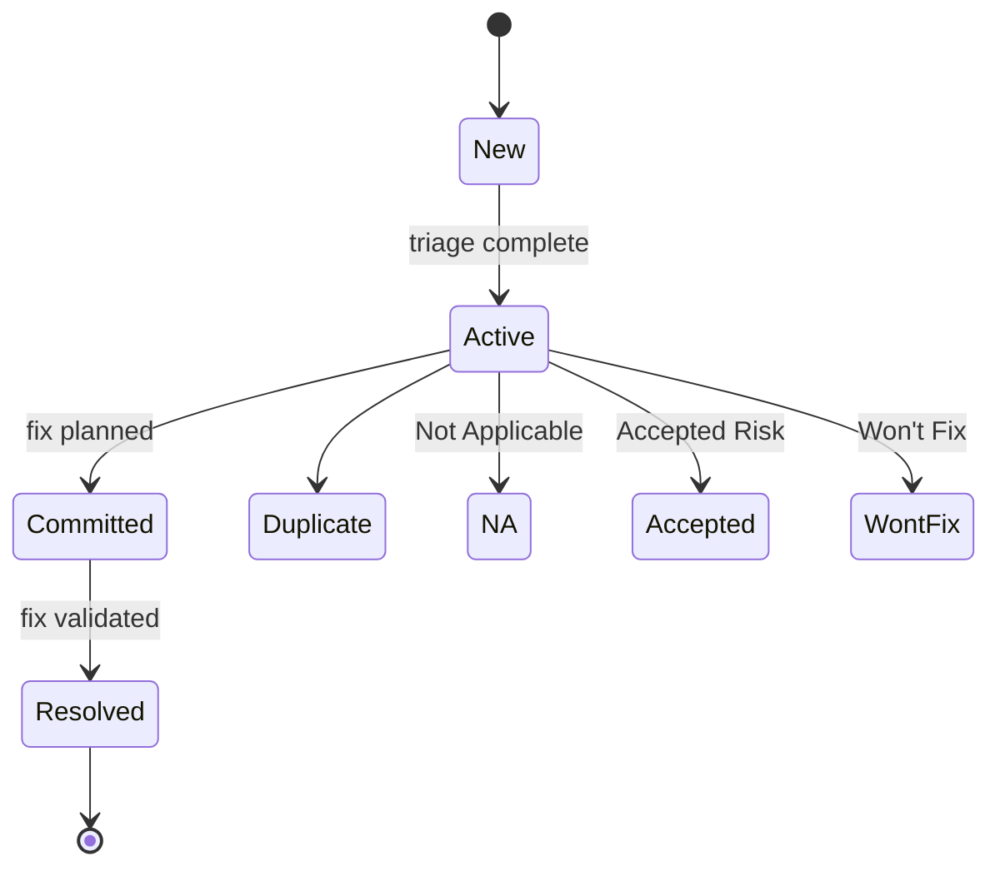
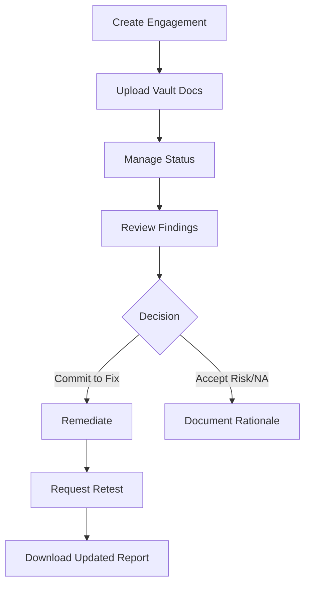
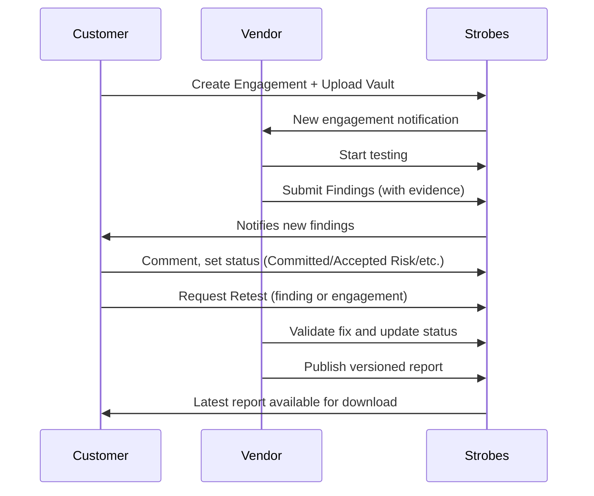
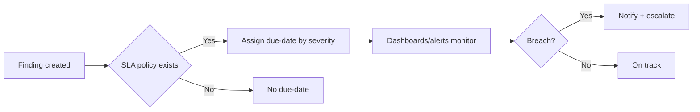

# Strobes CTEM & PTaaS – End‑to‑End User Guide (Customers + Vendors)

An end‑user handbook that walks through the full lifecycle: from creating an engagement to final report closure. Built for customers and vendors/MSSPs.

---

## Contents

* [1. Overview](#1-overview)
* [2. Customer Guide](#2-customer-guide)
* [3. Vendor Guide](#3-vendor-guide)
* [4. End‑to‑End Lifecycle](#4-end-to-end-lifecycle)
* [5. Videos (by task)](#5-videos-by-task)
* [6. Configuration: Custom Fields, SLAs, Statuses & Automations](#6-configuration-custom-fields-slas-statuses--automations)
* [7. FAQs](#7-faqs)

---

## 1. Overview

Strobes supports Continuous Threat Exposure Management (CTEM) and PTaaS. Customers create and manage engagements, review findings, request retests, and download reports. Vendors review scope, test, submit findings, validate retests, and publish reports.

---

## 2. Customer Guide

### 2.1 Create an Engagement

Provide the testing context up front so vendors can start quickly.

**Steps**

1. Go to **PTaaS → Engagements → New**.
2. Fill **Title**, **Objectives**, **Dates**.
3. Select **Services** (Vendor‑Managed or Self‑Managed).
4. Add **Assets** and define exposure/sensitivity.
5. Open **Vault** and upload credentials, VPN, and docs.
6. Add prerequisites or custom fields if your org uses them.
7. Save; post an **engagement comment** if anything is urgent.

**Help & Video**

* Help: [https://help.strobes.co/en/article/creating-engagements](https://help.strobes.co/en/article/creating-engagements)
* Video (Vendor‑Managed): [https://app.arcade.software/share/h2E5FGganjBpicinOp6i](https://app.arcade.software/share/h2E5FGganjBpicinOp6i)
* Video (Self‑Managed): [https://app.arcade.software/share/ektKfQ0RX8IQQaFCUZaq](https://app.arcade.software/share/ektKfQ0RX8IQQaFCUZaq)

### 2.2 Comments & Status

Keep the audit trail tidy and the project moving.

**Steps**

1. Use **engagement comments** for scope clarifications and updates.
2. Update **Status** as work progresses: Scheduled → In Progress → Request to Retest → Finished (custom statuses allowed).
3. Note blockers (e.g., VPN expiry) and tag owners.

**Help & Video**

* Help: [https://help.strobes.co/en/article/life-cycle-of-an-assessment-in-an-engagement](https://help.strobes.co/en/article/life-cycle-of-an-assessment-in-an-engagement)
* Video: [https://app.arcade.software/flows/2hdKCG0CoZYL2ayWySTv/view](https://app.arcade.software/flows/2hdKCG0CoZYL2ayWySTv/view)

### 2.3 Findings: Review & Act

Assessments generate findings under each engagement.

**Steps**

1. Open **Findings**; filter by severity, status, asset, or tag.
2. Read the description, PoC, and remediation notes.
3. Discuss in **comments**; attach logs/screenshots.
4. Set status:

   * **Committed** (planned fix)
   * **Accepted Risk** or **Won’t Fix** (include rationale)
   * **Duplicate** / **Not Applicable** as needed
5. When fixed, attach proof (PR link, config screenshot) and request retest.

**Help & Video**

* Help: [https://help.strobes.co/en/article/vulnerabilities-views](https://help.strobes.co/en/article/vulnerabilities-views)
* Video: [https://app.arcade.software/share/WEA7s5BqHbYOIBRvZOdk](https://app.arcade.software/share/WEA7s5BqHbYOIBRvZOdk)

**Vulnerability lifecycle**

### 2.4 Retesting

Validate that fixes hold.

**Steps**

1. For a single item, open the finding → **Request Retest**.
2. For many fixes, set engagement to **Request to Retest** and summarize changes.
3. Vendor validates and updates status to **Resolved** if it passes.

**Help & Video**

* Help: [https://help.strobes.co/en/article/life-cycle-of-an-assessment-in-an-engagement](https://help.strobes.co/en/article/life-cycle-of-an-assessment-in-an-engagement)
* Video: [https://app.arcade.software/flows/2hdKCG0CoZYL2ayWySTv/view](https://app.arcade.software/flows/2hdKCG0CoZYL2ayWySTv/view)

### 2.5 Reporting

Get audit‑ready PDFs when you need them.

**Steps**

1. Open **Reports** inside the engagement.
2. Review executive summary and technical details.
3. Download the latest **versioned** report.

**Help & Videos**

* Help: [https://help.strobes.co/en/article/generating-pdf-reports](https://help.strobes.co/en/article/generating-pdf-reports)
* Video 1: [https://app.arcade.software/share/Rdad8MrPMVc7o5y1tTPR](https://app.arcade.software/share/Rdad8MrPMVc7o5y1tTPR)
* Video 2: [https://app.arcade.software/share/V92B1kLDfkVnENBxggAQ](https://app.arcade.software/share/V92B1kLDfkVnENBxggAQ)

**Customer process map**

---

## 3. Vendor Guide

### 3.1 Review & Accept

Confirm scope, assets, and prerequisites before testing.

**Steps**

1. Open new engagement; read scope and objectives.
2. Check **Vault** (credentials, VPN, diagrams).
3. Flag gaps via **comments**; set start date.
4. Move status to **In Progress** when testing starts.

### 3.2 Submit Findings

Consistency helps customers act faster.

**Steps**

1. Create finding with clear reproduction steps and impact.
2. Attach evidence; map to CWE/CVE/OWASP where useful.
3. Provide remediation guidance; keep severity rationale tight.
4. Respond to comments; update status as work advances.

**Help & Video**

* Help: [https://help.strobes.co/en/article/vulnerabilities-views](https://help.strobes.co/en/article/vulnerabilities-views)
* Video: [https://app.arcade.software/share/WEA7s5BqHbYOIBRvZOdk](https://app.arcade.software/share/WEA7s5BqHbYOIBRvZOdk)

### 3.3 Retest & Close

**Steps**

1. Pick up **Request Retest** items.
2. Validate fixes; update to **Resolved** if successful.
3. If not reproducible or still exploitable, revert to **Active** with notes.

### 3.4 Reporting

**Steps**

1. Generate PDF with executive + technical sections.
2. Publish the latest version to the engagement.

**Help & Videos**

* Help: [https://help.strobes.co/en/article/generating-pdf-reports](https://help.strobes.co/en/article/generating-pdf-reports)
* Video 1: [https://app.arcade.software/share/Rdad8MrPMVc7o5y1tTPR](https://app.arcade.software/share/Rdad8MrPMVc7o5y1tTPR)
* Video 2: [https://app.arcade.software/share/V92B1kLDfkVnENBxggAQ](https://app.arcade.software/share/V92B1kLDfkVnENBxggAQ)

### 3.5 Optional Modules (when applicable)

* **DAST**

  * Basic scan: [https://app.arcade.software/share/hseUV8hrOkAgmkKY4G8C](https://app.arcade.software/share/hseUV8hrOkAgmkKY4G8C)
  * Web app scan setup: [https://app.arcade.software/share/eYxUnrfaQsssFI9eSYwH](https://app.arcade.software/share/eYxUnrfaQsssFI9eSYwH)
  * Advanced (YAML/HCL AppScan): [https://app.arcade.software/share/WrDDPbR3FIfTL9To74bh](https://app.arcade.software/share/WrDDPbR3FIfTL9To74bh)
* **SAST**

  * With Git: [https://app.arcade.software/share/sdEmHPdfwxKqanv9L8Ts](https://app.arcade.software/share/sdEmHPdfwxKqanv9L8Ts)
  * GitHub: [https://app.arcade.software/share/9Kfa0mi6tIGhBpDfdT91](https://app.arcade.software/share/9Kfa0mi6tIGhBpDfdT91)
  * Azure Repos: [https://app.arcade.software/share/W4l3exjt8CvnHrS0vnUO](https://app.arcade.software/share/W4l3exjt8CvnHrS0vnUO)
  * Semgrep GitHub: [https://app.arcade.software/share/vtEukKgY0dsBr0j3iS2j](https://app.arcade.software/share/vtEukKgY0dsBr0j3iS2j)
* **SCA/SBOM**

  * With Git: [https://app.arcade.software/share/XkcrpJw9h2GZrwVMNoIB](https://app.arcade.software/share/XkcrpJw9h2GZrwVMNoIB)
* **CSPM**

  * AWS: [https://app.arcade.software/share/kBIVB5OPLRUmffosTw8H](https://app.arcade.software/share/kBIVB5OPLRUmffosTw8H)
  * GCP: [https://app.arcade.software/share/fzkGgBjFucDtXxGqQnNL](https://app.arcade.software/share/fzkGgBjFucDtXxGqQnNL)
* **Containers**

  * ECR: [https://app.arcade.software/share/lCQPKaiefdRvO4dYZCho](https://app.arcade.software/share/lCQPKaiefdRvO4dYZCho)
  * Docker: [https://app.arcade.software/share/21ajE3eM3Yq34nCyfeD7](https://app.arcade.software/share/21ajE3eM3Yq34nCyfeD7)
* **Imports & Integrations**

  * Nessus: [https://app.arcade.software/share/9Wtuz36xhAqfUhLLKprK](https://app.arcade.software/share/9Wtuz36xhAqfUhLLKprK)
  * Burp Suite: [https://app.arcade.software/share/CfFNopJ99WTRYknJA75Z](https://app.arcade.software/share/CfFNopJ99WTRYknJA75Z)
  * Nmap: [https://app.arcade.software/share/AQHlqF4UOAFiKiHtqici](https://app.arcade.software/share/AQHlqF4UOAFiKiHtqici)
  * Snyk: [https://app.arcade.software/share/dN5WkVeP25B2HqYat0Mh](https://app.arcade.software/share/dN5WkVeP25B2HqYat0Mh)

---

## 4. End‑to‑End Lifecycle

**High‑level flow**

---

## 5. Videos (by task)

Shortcuts to commonly used clips for quick onboarding.

**Getting in and setup**

* Login: [https://app.arcade.software/share/u1KQpf9UxpfJVVt42DqI](https://app.arcade.software/share/u1KQpf9UxpfJVVt42DqI)
* Invite team: [https://app.arcade.software/share/FF1Q39AAo7XEWMYZA8Xw](https://app.arcade.software/share/FF1Q39AAo7XEWMYZA8Xw)
* Two‑factor: [https://app.arcade.software/share/Sr0Va0r2XzdGxsF0bnB7](https://app.arcade.software/share/Sr0Va0r2XzdGxsF0bnB7) | [https://app.arcade.software/share/NJc3ozqKEB0KMbjY0ca3](https://app.arcade.software/share/NJc3ozqKEB0KMbjY0ca3)
* Org creation: [https://app.arcade.software/share/yeeXYAnO5GqPSX1rWudt](https://app.arcade.software/share/yeeXYAnO5GqPSX1rWudt)

**Assets & dashboards**

* Assets overview: [https://app.arcade.software/share/gqPz9yxqP6RWs7VXLBF0](https://app.arcade.software/share/gqPz9yxqP6RWs7VXLBF0)
* Mark crown‑jewel assets: [https://app.arcade.software/share/OQLkdDB0kalSe3uvZ5UA](https://app.arcade.software/share/OQLkdDB0kalSe3uvZ5UA)
* Dashboards: [https://app.arcade.software/share/w9LCoBwl4CvpBJ1QTHD3](https://app.arcade.software/share/w9LCoBwl4CvpBJ1QTHD3)

**Automation & SLA**

* Automation quickstart: [https://app.arcade.software/share/FTnUliQzueRTPT9xJt0z](https://app.arcade.software/share/FTnUliQzueRTPT9xJt0z)
* Configure actions: [https://app.arcade.software/share/Os0qCxrxlvqfsg0Ipipd](https://app.arcade.software/share/Os0qCxrxlvqfsg0Ipipd)
* SLA policies: [https://app.arcade.software/share/TfrauIh17YlufgGMU8hS](https://app.arcade.software/share/TfrauIh17YlufgGMU8hS)

**Reporting**

* Create & customize reports: [https://app.arcade.software/share/ZORJVmoVqgHQDYNF2jl8](https://app.arcade.software/share/ZORJVmoVqgHQDYNF2jl8)

**RBVM & ASM (optional)**

* RBVM overview: [https://app.arcade.software/share/ScTvprNiE8b9dUjZlNkk](https://app.arcade.software/share/ScTvprNiE8b9dUjZlNkk)
* RBVM collection: [https://app.arcade.software/share/collections/5yEXzgyVrnJk2EgSpGCn](https://app.arcade.software/share/collections/5yEXzgyVrnJk2EgSpGCn)
* ASM overview: [https://app.arcade.software/share/Mu1B9SgAslRlZdy0GNJe](https://app.arcade.software/share/Mu1B9SgAslRlZdy0GNJe)
* Export ASM assets: [https://app.arcade.software/share/MxSXjdYtq7RVIHUvaUZv](https://app.arcade.software/share/MxSXjdYtq7RVIHUvaUZv)

---

## 6. Configuration: Custom Fields, SLAs, Statuses & Automations

### 6.1 Custom Fields — when to use them

Use custom fields to capture org‑specific data for search, filters, dashboards, exports, and automation triggers.

**Engagement custom fields**
Add context vendors need to plan and test.

* Examples: *Compliance scope*, *Data classification*, *Change window*, *Business owner*.
* Where: **Engagement → Edit → Custom fields**.

**Asset custom fields**
Segment assets for prioritization and reporting.

* Examples: *Environment* (Prod/Stage), *Criticality*, *Crown‑jewel (Y/N)*, *Compliance scope (PCI/HIPAA)*.
* Tips: bulk edit from the grid, keep names consistent, prefer dropdowns over free text.

**Finding custom fields**
Standardize remediation metadata.

* Examples: *Fix owner team*, *Jira key*, *Exploit status*, *Patch window*, *Root cause*.
* Tips: update in bulk from **Vulnerabilities**; include helper text so values are chosen correctly.

---

### 6.2 SLA due‑dates setup

Set target fix dates by severity, then monitor and escalate when needed.

**Define org‑wide policy**

1. Open **Settings → SLA Policy**.
2. Set days‑to‑fix by severity (e.g., Critical=2, High=15, Medium=30, Low=45).
3. Save — new findings get due‑dates automatically.

**Override at scale**

1. Go to **Vulnerabilities**.
2. Select rows → **Actions → SLA** → choose a new due‑date (or clear).

**Track & alert**

* Use dashboards to spot breaches and workload.
* Enable email/Slack alerts for due‑date breaches or key state changes.

---

### 6.3 Custom assessment/engagement status

Align states to your delivery stages so teams interpret progress the same way.

**Defaults**

* Engagement: *Scheduled → In Progress → Request to Retest → Finished* (+ optional custom states such as *Request for Review*).
* Finding: *New, Active, Committed, Resolved, Duplicate, Not Applicable, Accepted Risk, Won’t Fix*.

**Patterns that work**

* Add an **Internal Review** state before publishing a report.
* Add **Awaiting Customer Fix** if triage is done but remediation is pending.
* Keep states mutually exclusive; avoid duplicating what custom fields already capture.

**Where to edit**

* Org/engagement settings (admin‑only areas) expose status customization.

---

### 6.4 Automations

Automate handoffs and notifications so progress doesn’t stall.

**Recipes**

* **Critical finding alert** → send to a Slack/Email channel for rapid action.
* **New engagement** → notify vendor lead and create tasks.
* **Report published** → email link to customer PM.
* **SLA breach** → escalate to on‑call.

**Set up**

1. Open **Automation**.
2. Pick a **trigger** (Finding created, State changed, SLA breached, Engagement created).
3. Add **conditions** (severity, asset env, tags, custom fields).
4. Choose **actions** (post to Slack/Teams/Email/Jira, add tag, reassign, change state).
5. Test with a sample record, then enable.

**Practical tips**

* Use tags/custom fields as precise filters.
* Keep alerts concise and include a deep link to the record.
* Start with notifications; add state‑changing actions after a short proving period.

---

## 7. FAQs

**Why can’t I start testing yet?**  Missing Vault inputs or approval windows.

**Where do I track retest results?**  Inside each finding or at engagement level when retesting many fixes.

**Report shows old data.**  Ask the vendor to publish a new version after retest.

**Video access issues.**  Request access or share a view‑only link from your admin.

**Need help fast?**  Use engagement comments to alert the project lead and keep the trail tidy.
